# System Rejestracji w Przychodniach Lekarskich
Projekt polegał na stworzeniu systemu rejestracji w przychodniach lekarskich. Ma za zadanie ułatwić rejestracje pacjentów w przychodniach na terenie Warszawy, poprzez zarządzanie danymi posiadanymi przez przychodnię.

## Zakres projektu
System umożliwia sprawniejsze zarządzanie informacjami o pacjentach, lekarzach, przychodniach oraz wizytach lekarskich. Umożliwia rejestrację pacjentów w systemie wraz z ich danymi osobowymi, przypisanie pacjenta do odpowiedniej przychodni oraz zapisanie się na wizytę u wybranego lekarza. System pozwala na planowanie i ewidencjonowanie wizyt, przypisując do każdej z nich konkretnego lekarza, pacjenta, datę i godzinę oraz typ i status wizyty. Umożliwia również zarządzanie grafikiem pracy lekarzy poprzez encję dyżurów oraz przypisywanie lekarzy do konkretnych gabinetów lekarskich w ramach danej przychodni. Przychodnie przypisane są do określonych dzielnic, co wspomaga organizację i lokalizację usług medycznych. System wspiera także przechowywanie informacji kontaktowych oraz specjalizacji lekarzy, co ułatwia dopasowanie ich do odpowiednich typów wizyt. Dodatkowo umożliwia śledzenie, którzy lekarze zastępują innych w przypadku nieobecności

## Wymagania funkcjonalne
- W przychodni zatrudnieni są lekarze (nr PWZ, imię, nazwisko, specjalizacja, adres e-mail, numer telefonu). Każdy lekarz może mieć jednego lekarza, który go zastępuje.
- Każdy lekarz ma przypisany jeden gabinet lekarski (nr gabinetu, typ gabinetu). Gabinet może być używany przez wielu lekarzy.
- W systemie przechowywane są szczegóły dotyczące wizyty (ID wizyty, nr PWZ lekarza przeprowadzającego wizytę, data i godzina wizyty, typ wizyty oraz status wizyty). Każdą wizytę prowadzi jeden lekarz.
- Lekarz może prowadzić wizytę podczas swojego dyżuru (nr PWZ, data i godzina rozpoczęcia dyżuru, data i godzina zakończenia dyżuru).
- System przechowuje informacje o przychodniach (ID przychodni, adres, nazwa przychodni oraz numer telefonu). Każda przychodnia należy do jednej dzielnicy w Warszawie.
- W przychodni zarejestrowani są pacjenci (ID pacjenta, imię, nazwisko, adres zamieszkania, data urodzenia, numer telefonu, PESEL). Każdy pacjent może być zapisany wyłącznie do jednej przychodni.
- Pacjent może zapisać się na wiele wizyt.
- Do przychodni przypisani są lekarze oraz gabinety lekarskie.

## Model pojęciowy
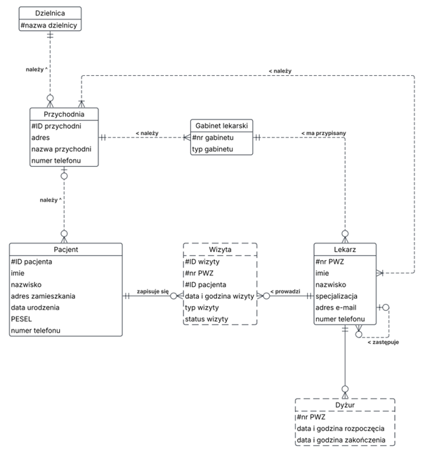

## Model logiczny
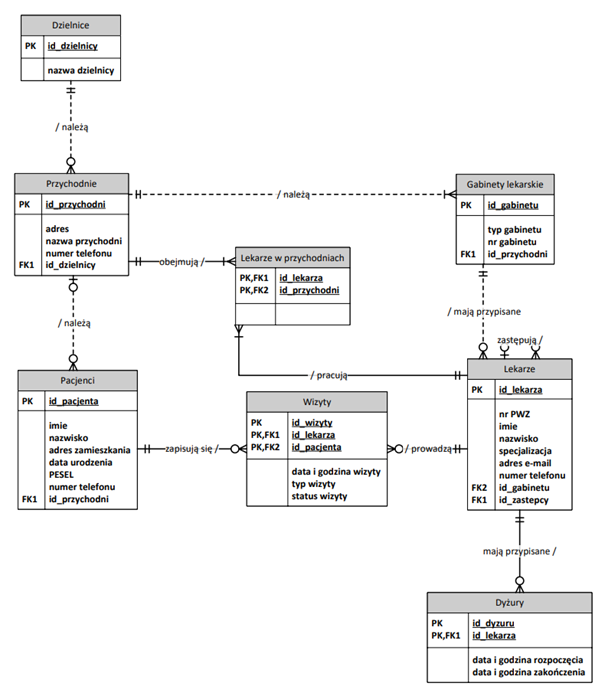

## Model implementacyjny
Model implementacyjny bazy danych zawarty jest w pliku o tej samej nazwie.

### Opis zaimplementowanych funkcji systemu
- Dodawanie/edycja/usuwanie lekarzy do/z bazy danych.
- Dodawanie/edycja/usuwanie pacjentów do/z bazy danych.
- Dodawanie/edycja/usuwanie wizyt zaplanowanych/zrealizowanych/anulowanych do/z bazy danych.
- Dodawanie/edycja/usuwanie dyżurów do/z bazy danych.
- Dodawanie/edycja/usuwanie lekarzy w przychodniach do/z bazy danych.
- Dodawanie/edycja/usuwanie przychodni do/z bazy danych.
- Dodawanie/edycja/usuwanie gabinetów lekarskich do/z bazy danych.
- Dodawanie/edycja/usuwanie dzielnic do/z bazy danych.

## Moduły systemu
### Formularz menu
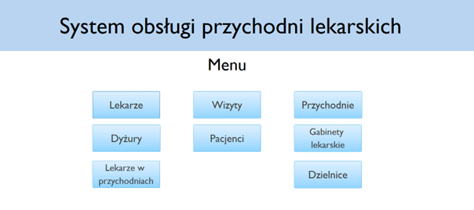
Pozwala użytkownikowi aplikacji na nawigowanie pomiędzy formularzami dostępnymi w aplikacji. Naciśnięcie przycisku powoduje przejście do danego formularza. 

Każdy z tych formularzy zawiera następujące przyciski:
#### Operacje na rekordach
- Nowy rekord - dodaje nowy, czysty rekord do którego użytkownik wprowadza dane
- Usuń rekord - usuwa aktualnie wybrany rekord z bazy danych
- Zapisz rekord - zapisuje wprowadzone dane w wybranym rekordzie

#### Nawigacje po rekordach
- Przycisk strzałki w prawo - pokazuje kolejny rekord w bazie
- Przycisk strzałki w lewo - pokazuje poprzedni rekord w bazie
- Ostatni rekord - pokazuje ostatni rekord w bazie
- Pierwszy rekord - pokazuje pierwszy rekord w bazie

#### Zarządzanie formularzem
- Odśwież formularz - odświeża otwarty formularz
- Powrót do menu - powraca do formularza Menu
- Zamknij formularz - zamyka formularz

### Formularz lekarze
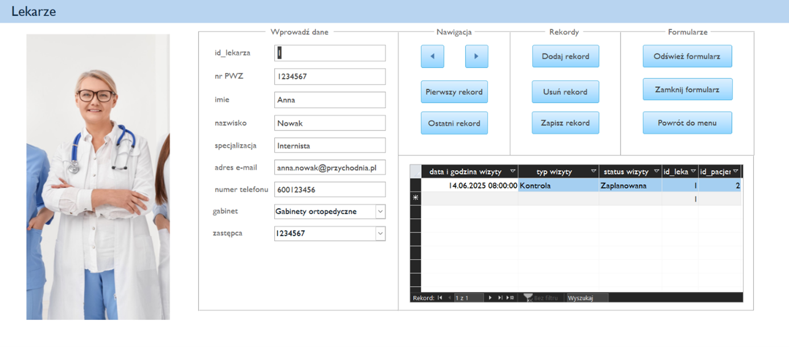
Po naciśnięciu przycisku „Lekarze” w formularzu Menu, zostaje otwarty formularz Lekarze. Pozwala on na dodawanie, edycje, usuwanie lekarzy do/z bazy danych oraz przeglądanie wszystkich wizyt, które przeprowadza lekarz. 

Formularz zawiera pola:
- id_lekarza - automatycznie generowane ID
- nr PWZ - nr. PWZ lekarza
- imię - imię lekarza
- nazwisko - nazwisko lekarza
- specjalizacja - specjalizacja lekarza
- adres e-mail - adres e-mail
- numer telefonu - numer telefonu
- gabinet - lista rozwijana, z której można wybierać gabinet
- zastępca - lista rozwijana, z której można wybierać zastępcę

Formularz zawiera jeden podformularz:
  - Informacja o liście wizyt dla danego lekarza

### Formularz dużuru
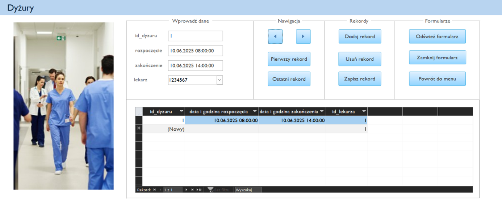
Po naciśnięciu przycisku „Dyżury” w formularzu Menu, zostaje otwarty formularz Dyżury. Pozwala on na dodawanie, edycje, usuwanie dyżurów do/z bazy danych oraz przeglądanie wcześniej dodanych dyżurów dla danego lekarza.

Formularz zawiera pola:
- id_dyżuru: - automatycznie generowane ID 
- rozpoczęcie - data i godzina rozpoczęcia dyżuru
- zakończenie - data i godzina zakończenia dyżuru
- lekarz - lsta rozwijana, z której można wybierać lekarza pełniącego dyżur

Formularz zawiera jeden podformularz:
  - Informacja o liście dyżurów dla danego lekarza

### Formularz wizyty
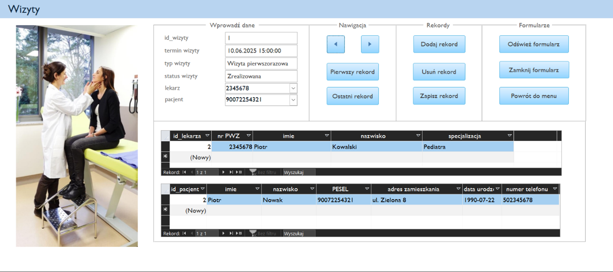
Po naciśnięciu przycisku „Wizyty” w formularzu Menu, zostaje otwarty formularz Wizyty. Pozwala on na dodawanie, edycje, usuwanie wizyt do/z bazy danych oraz przeglądanie dokładniejszych danych dla przypisanego do wizyty pacjenta oraz lekarza.  

Formularz zawiera pola:
- id_wizyty - automatycznie generowane ID
- termin wizyty - termin wizyty
- status wizyty - status wizyty
- lekarz - lista rozwijana, z której można wybierać lekarza
- pacjent - lista rozwijana, z której można wybierać pacjenta

Formularz zawiera dwa podformularze:
  - Informacja o danych pacjent;
  - Informacja o danych lekarza

### Formularz pacjenci
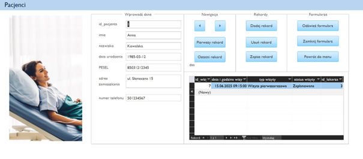
Po naciśnięciu przycisku „Pacjenci” w formularzu Menu, zostaje otwarty formularz Pacjenci. Pozwala on na dodawanie, edycje, usuwanie pacjentów do/z bazy danych oraz przeglądanie wszystkich dodanych wizyt dla danego pacjenta.

Formularz zawiera pola:
- id_pacjenta - automatycznie generowane ID
- imię - imię pacjenta
- nazwisko - nazwisko pacjenta
- data urodzenia - data urodzenia pacjenta
- PESEL - PESEL pacjenta
- adres zamieszkania - adres zamieszkania pacjenta
- numer telefonu - numer telefonu pacjenta

Formularz zawiera jeden podformularz:
  - Informacja o liście wizyt dla danego pacjenta

### Formularz przychodnie
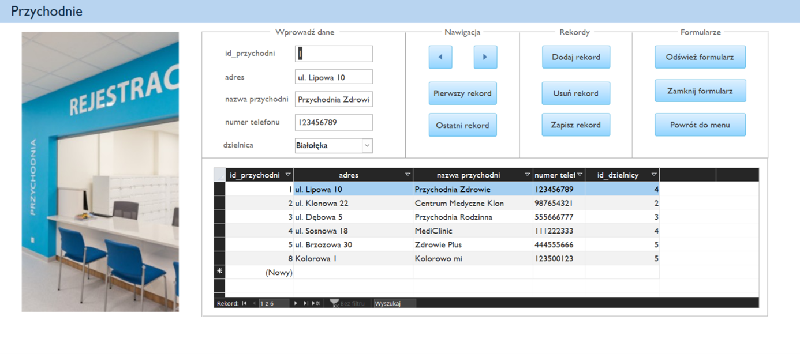
Po naciśnięciu przycisku „Przychodnie” w formularzu Menu, zostaje otwarty formularz Przychodnie. Pozwala on na dodawanie, edycje, usuwanie przychodni do/z bazy danych oraz przeglądanie wcześniej dodanych przychodni.

Formularz zawiera pola:
- id_przychodni - automatycznie generowane ID
- adres - adres
- nazwa przychodni - nazwa przychodni
- dzielnica - lista rozwijana, z której można wybierać dzielnice

Formularz zawiera jeden podformularz:
  - Informacja o dostępnej liście przychodni

### Formularz gabinety
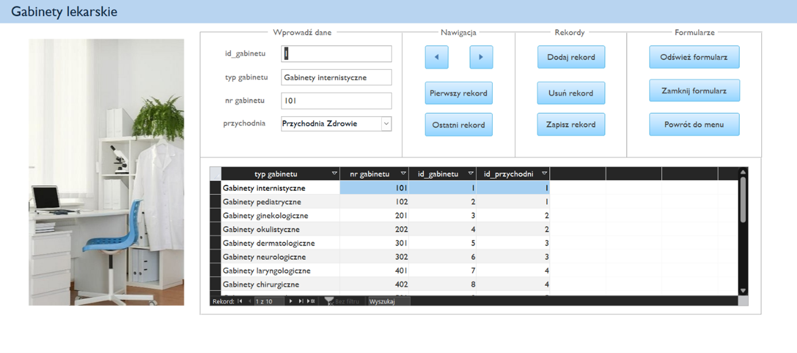
Po naciśnięciu przycisku „Gabinety lekarskie” w formularzu Menu, zostaje otwarty formularz Gabinety lekarskie. Pozwala on na dodawanie, edycje, usuwanie gabinetów do/z bazy danych oraz przeglądanie wcześniej dodanych gabinetów. 

Formularz zawiera pola:
  - id_gabinetu - automatycznie generowane ID
  - typ gabinetu - lista rozwijana, z której można wybierać typ gabinetu
  - nr gabinetu - numer gabinetu
  - przychodnia - lista rozwijana, z której można wybierać przychodnie

Formularz zawiera jeden podformularz:
  - Wcześniej dodane gabinety lekarskie

### Formularz lekarze w przychodniach
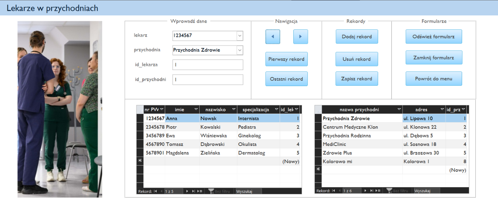
Po naciśnięciu przycisku „Lekarze w przychodniach” w formularzu Menu, zostaje otwarty formularz Lekarze w przychodniach. Pozwala on na dodawanie, edycje, usuwanie lekarzy należących do danej przychodni do/z bazy danych oraz przeglądanie wcześniej dodanych lekarzy oraz przychodni. 

Formularz zawiera pola:
  - lekarz - lista rozwijana, z której można wybierać lekarza
  - przychodnia - lista rozwijana, z której można wybierać przychodnię
  - id_lekarza - pobierane ID od lekarz przypisanego do danej przychodni
  - id_przychodni - pobieranie ID od przychodni przypisanej do danego lekarza

Formularz zawiera jeden podformularz:
  - Wcześniej dodanych lekarzy
  - Wcześniej dodane przychodnie

### Formularz dzielnice
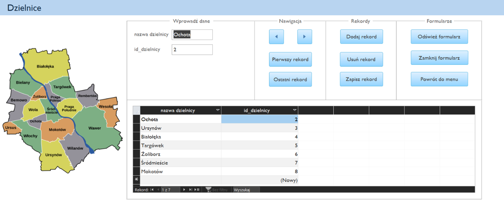
Po naciśnięciu przycisku „Dzielnice” w formularzu Menu, zostaje otwarty formularz Dzielnice. Pozwala on na dodawanie, edycje, usuwanie dzielnic do/z bazy danych oraz przeglądanie wcześniej dodanych dzielnic. 

Formularz zawiera pola:
  - nazwa dzielnicy - Nazwa dzielnicy
  - id_dzielnicy - Automatycznie generowane ID

Formularz zawiera jeden podformularz:
  - Informacja o dostępnych dzielnicach

## Autorzy
Projekt został wykonany w ramach przedmiotu __Bazy Danych (SQL)__ przez:
- Klaudia Adamczyk
- Oliwia Latoszek
- Kacper Grzeszyk
